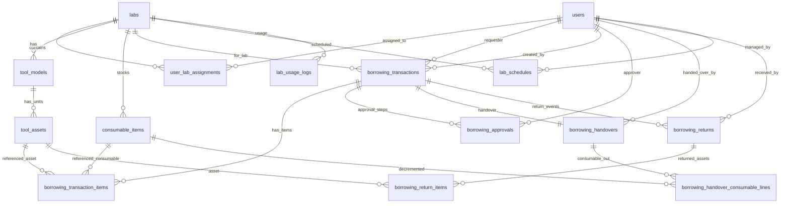

# SILAB-KL ERD & Status Flow (Draft)

## Prinsip Desain

- Transaksi peminjaman mendukung item campuran (alat + bahan habis pakai)
- Handover harus penuh (no partial handover)
- Return bisa parsial, tetapi hanya untuk alat
- Approval 2 level fleksibel urutan, namun 2 approver harus berbeda
- Satu transaksi hanya untuk satu lab

## Status Flow Peminjaman (Header Transaksi)

### Status yang Disarankan

- `draft` (opsional, jika nanti ada form multi-step)
- `submitted`
- `pending_approval` (belum lengkap 2 approval)
- `approved_waiting_handover`
- `active`
- `partially_returned`
- `completed`
- `cancelled`
- `rejected`

### Aturan Transisi

- `submitted` -> `pending_approval`
- `pending_approval` -> `approved_waiting_handover` (setelah 2 approval valid)
- `pending_approval` -> `rejected`
- `pending_approval` -> `cancelled` (oleh mahasiswa jika belum approval pertama; oleh admin/PLP sesuai kebijakan UI)
- `approved_waiting_handover` -> `active` (handover sukses, semua item terserah)
- `approved_waiting_handover` -> `cancelled` (dibatalkan petugas)
- `active` -> `partially_returned` (sebagian asset alat kembali)
- `active` -> `completed` (semua asset alat kembali)
- `partially_returned` -> `completed` (sisa asset alat kembali)

Catatan:
- `overdue` disarankan sebagai status turunan (derived) dari `due_date < now` dan masih ada asset alat outstanding.

## ERD (Konseptual - Mermaid)

## Entitas Inti dan Tujuannya

### `users`

Menyimpan akun login (`admin`, `mahasiswa`, `petugas_plp`).

### `user_lab_assignments`

Relasi many-to-many user (`petugas_plp`) ke lab.

### `labs`

Master laboratorium.

### `tool_models`

Master jenis alat (nama alat, kategori, spesifikasi ringkas, lab).

### `tool_assets`

Unit fisik alat (QR, kode inventaris, kondisi, status ketersediaan).

### `consumable_items`

Master bahan habis pakai + total stok + minimum stok.

### `borrowing_transactions`

Header transaksi peminjaman (satu lab, satu requester, status, timestamp utama).

### `borrowing_transaction_items`

Detail item campuran. Tipe item:
- `tool_asset`
- `consumable`

Aturan:
- Untuk `tool_asset`: referensi ke `tool_asset_id`, qty selalu `1`
- Untuk `consumable`: referensi ke `consumable_item_id`, qty > 0

### `borrowing_approvals`

Mencatat event approval/reject.

Aturan:
- Maksimal 2 approval sukses per transaksi
- Approver harus unik (tidak boleh user yang sama dua kali)

### `borrowing_handovers`

Catat serah terima final (sekali per transaksi, karena no partial handover).

### `borrowing_handover_consumable_lines`

Snapshot jumlah bahan yang benar-benar diserahkan dan dipotong stoknya saat handover.

### `borrowing_returns`

Header event pengembalian (satu transaksi bisa banyak event karena partial return).

### `borrowing_return_items`

Detail asset alat yang dikembalikan pada event return.

Aturan:
- hanya tool asset
- satu asset tidak boleh direturn dua kali pada transaksi yang sama

### `lab_schedules`

Jadwal penggunaan lab (input manual).

### `lab_usage_logs`

Riwayat penggunaan lab (bisa diisi manual/otomatis dari jadwal yang terealisasi pada fase berikutnya).

## Aturan Integritas Penting (DB-Level / App-Level)

### Approval

- App-level:
  - hanya `admin`/`petugas_plp`
  - `petugas_plp` wajib assigned ke lab transaksi
- DB-level:
  - unique `(transaction_id, approver_user_id)` untuk cegah approval ganda oleh user sama

### Handover

- Hanya boleh jika total approval valid = 2
- Tidak boleh jika ada item tidak tersedia
- Hanya sekali per transaksi

### Return Parsial

- Hanya untuk item alat
- Tidak boleh melebihi asset yang dipinjam pada transaksi
- `completed` jika seluruh asset alat pada transaksi sudah returned

### Keterlambatan

- Derived:
  - transaksi `active` / `partially_returned`
  - `due_date < now`
  - masih ada asset alat outstanding

## Definisi "Outstanding Asset" (untuk return dan overdue)

`Outstanding Asset` = asset alat yang tercantum di `borrowing_transaction_items` (tipe `tool_asset`) dan belum muncul di `borrowing_return_items` untuk transaksi tersebut.
